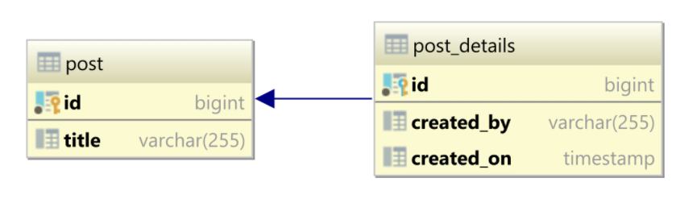
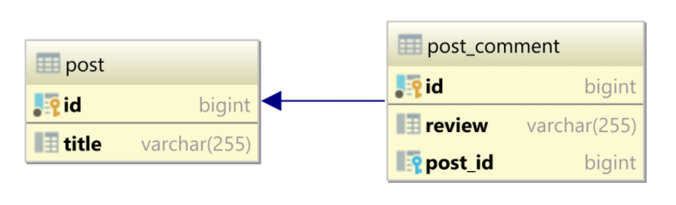
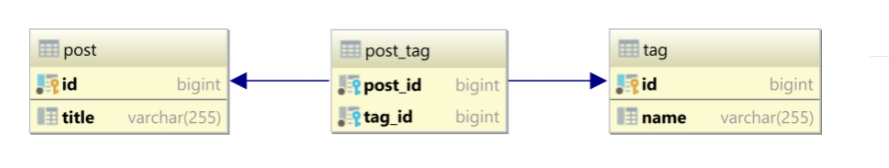

# Sql Introduction

## What's SQL?

SQL is the language used to create, search, extract and also manipulate data within a relational database. To make this possible, there are commands such as SELECT, UPDATE, DELETE, INSERT and WHERE, among others.

## Database types

##### Sql

- predefined tables
- no dynamic alterations in structure
- relation between tables

##### NoSql

- predefined structures are not mandatory
- has dynamic alterations in structure
- no oficial language

## What's constraints?

Rules and restrictions to manipulate data in SQL tables
See more at: [https://www.w3schools.com/sql/sql_constraints.asp](w3School)

Types of constraints:

- NOT NULL 

Ensures that field cannot contain null values

- UNIQUE 

Ensures that the value entered in the table  column is unique

- PRIMARY KEY 

A table's primary key ensures that the column this constraint is being applied to is the table's unique identifier.

- FOREIGN KEY

A table's foreign key references a primary key (value in a column with the PRIMARY KEY constraint) of another table, allowing a relationship between the two.

- DEFAULT

Ensures that if no value is entered in the column (or if the user enters a null value)

Snipet example bellow:

```sql  
DROP SCHEMA IF EXISTS ProductStore;
CREATE SCHEMA ProductStore;

CREATE TABLE ProductStore.Users (
  id INTEGER AUTO_INCREMENT PRIMARY KEY NOT NULL,
  username TEXT NOT NULL,
  classe TEXT NOT NULL,
  level INTEGER NOT NULL,
  password TEXT NOT NULL
);

CREATE TABLE ProductStore.Orders (
  id INTEGER AUTO_INCREMENT PRIMARY KEY NOT NULL,
  userId INTEGER,
  FOREIGN KEY (userId) REFERENCES ProductStore.Users (id)
);

CREATE TABLE ProductStore.Products (
  id INTEGER AUTO_INCREMENT PRIMARY KEY NOT NULL,
  name TEXT NOT NULL,
  amount TEXT NOT NULL,
  orderId INTEGER,
  FOREIGN KEY (orderId) REFERENCES ProductStore.Orders (id)
);
```
## What's a entity?

A table that represents some real-world concept you want to describe (person, events, happenings) and its properties (height, event time, event name). The person entity, for example, can have height, weight, and age properties. A party entity can have the event time, target audience and party date properties. Finally, a selling entity may own the properties sale value, day of sale, product sold, etc.

- Entity: Person
- Properties : Height, weight, age.

## Database relationships

- One to One Relationship (1:1): 
It is used to create a relationship between two tables in which a single row of the first table can only be related to one and only one records of a second table. Similarly, the row of a second table can also be related to anyone row of the first table.




- One to Many Relationship: 
It is used to create a relationship between two tables. Any single rows of the first table can be related to one or more rows of the second tables, but the rows of second tables can only relate to the only row in the first table. It is also known as a many to one relationship.




- Many to Many Relationship: 
It is many to many relationships that create a relationship between two tables. Each record of the first table can relate to any records (or no records) in the second table. Similarly, each record of the second table can also relate to more than one record of the first table. It is also represented an N:N relationship.



[Image source](https://vladmihalcea.com/database-table-relationships/)

## Database manipulation

On conditional update and deletion, you can pass a 'where id <> 0' parameter to bypass the safe updates mode

The sakila db can be found at https://dev.mysql.com/doc/index-other.html

```sql
UPDATE sakila.staff
SET first_name = 'Rannveig'
WHERE first_name = 'Ravein'
and id <> 0;
```

```sql
DELETE FROM sakila.film_text
WHERE title = 'ACADEMY DINOSAUR'
and id <> 0;
```

- Bulk UPDATE

For performance reasons, so that only one query request is sent to the server, we can do a bulk update.

Fix condition list
```sql
UPDATE sakila.actor
SET first_name = 'JOE'
WHERE actor_id IN (1,2,3); -- condition list
```

Update each item individually
```sql
UPDATE sakila.actor
SET first_name = (
CASE actor_id WHEN 1 THEN 'JOE' 
              WHEN 2 THEN 'DAVIS' 
              WHEN 3 THEN 'CAROLINE' 
          ELSE first_name  
END);
```
You can also set the safe_update to 0 for update and deletion without a where condition(key/value pair).

```sql
SET sql_safe_updates=1, sql_select_limit=1000, max_join_size=1000000;
```


