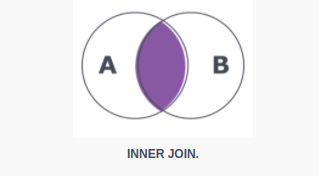
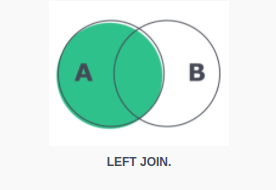

## What is a JOIN?

  

Function that combines records from two or more tables into the same result.

## Types of JOIN

  

- INNER JOIN

  

Allows returning all results in which the condition of the ON clause is satisfied.

  

code snippet:

```sql

SELECT a.column, b.column

FROM tableA AS a

INNER JOIN tableB AS b

ON a.related_column = b.related_column;

```

  

it focuses on bringing in only the records that have matching values in both tables.

  



  

- LEFT JOIN

  

when we use the LEFT JOIN , we focus on the table on the left (actor table on below example. All records from the left table and corresponding values from the right table, if any, are returned. Values that have no matches are displayed as null.

  

```sql
SELECT
c.customer_id, c.first_name, c.last_name,
a.actor_id,a.first_name,a.last_name

FROM 
customer AS c
LEFT JOIN actor AS a
ON c.last_name = a.last_name
ORDER BY c.last_name;
```



- RIGHT JOIN

Same as LEFT but considering the right table.